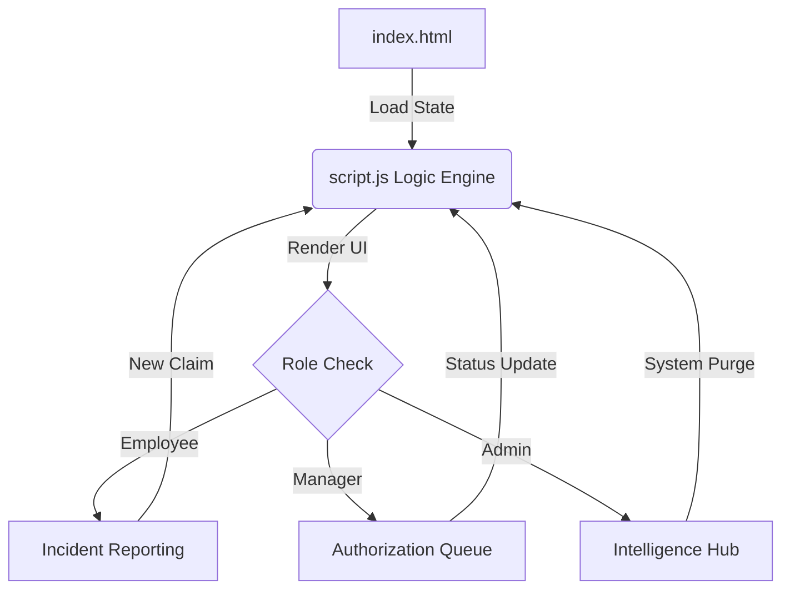

<p align="center">
  
</p>

<h1 align="center">Insurify Pro — Enterprise Insurance Cloud</h1>

<p align="center">
  <strong>The ultimate insurance infrastructure that turns complex claim management into a seamless digital experience.</strong>
</p>

<blockquote align="center">
  "Secure, Scalable, and Sophisticated – redefining how organizations manage vehicle assets."
</blockquote>

---

## 🔗 Live Infrastructure

The production environment is live and accessible at:  
🚀 **[bespoke-peony-6146ef.netlify.app](https://bespoke-peony-6146ef.netlify.app)**

---

## 🏛️ Architecture Overview

Insurify Pro operates as a **Multi-Role Hybrid System**, managing state across three distinct authorization layers: The Employee Runtime, Managerial Workflow, and Administrative Intelligence.

---


## 💎 Key Features

### 🔐 Multi-Tier Authorization
Experience a robust **role-based access system** designed for enterprise-grade security:
- 👤 **Employee** — Submit and track incidents  
- 🧑‍💼 **Manager** — Review and authorize claims  
- 🛡️ **Admin** — Control system-wide configurations  

> Each role is securely isolated using intelligent role-check logic, ensuring data integrity and controlled access.

---

### 📝 Smart Incident Reporting
Streamlined and intelligent reporting with:
- ✅ Real-time validation for **Vehicle Plate IDs**  
- 📂 Simulated **digital proof attachments**  
- ⚡ Instant claim submission to the **managerial review queue**

---

### 📊 Intelligence Hub
A powerful dashboard for data-driven decisions:
- 📈 Track **Active Portfolio**
- ✔️ Monitor **Settled Assets**
- 📉 Analyze **Compliance Rates**

> Built with a modern **glassmorphism UI** for a premium and intuitive experience.

---

### 📱 Performance Optimized & Responsive
Designed for speed, scalability, and elegance:
- ⚡ **Ultralight Bundle** — Vanilla JavaScript for lightning-fast performance  
- 📐 **Fully Responsive** — Seamless experience from mobile to 4K displays  
- 🎨 **Glassmorphism UI** — Sleek visuals with smooth transitions  

---

## 🔄 Workflow Walkthrough

### 1️⃣ Reporting Phase *(Employee)*
Employees submit incident reports through a dedicated interface:
- 🆔 Unique **INC-ID** generated  
- ⏱️ Timestamp recorded  
- 🌐 Data pushed to global `appState`  

---

### 2️⃣ Authorization Phase *(Manager)*
Managers handle incoming claims efficiently:
- 📋 Monitor the **Review Queue**  
- ✔️ **Authorize** or ❌ **Dismiss** claims  
- 🧾 Automatic **audit log entries** for every action  

---

### 3️⃣ Management Phase *(Admin)*
Admins oversee and maintain the system:
- 🧠 Access **Intelligence Hub**  
- ⚙️ Manage policies & infrastructure  
- 🧹 Perform **system maintenance & log purging**  

---

## ⚙️ Configuration Flow

The system synchronizes user roles and dynamic claims using a centralized state object, ensuring that updates in the reporting layer reflect immediately in the audit trail.


---

## 📂 Project Structure

```bash
├── index.html      # 🧱 UI Structure & Layout
├── script.js       # ⚙️ Core Logic & State Management
├── style.css       # 🎨 Styling, Animations & Responsiveness
└── README.md       # 📘 Documentation
```
--- 


## ⚙️ Installation & Setup

### 🚀 Clone the Repository
```bash
git clone https://github.com/ushantsingh/Vehicle-Insurance-Management-System.git
```

📁 Navigate to Project Directory
```bash
cd Vehicle-Insurance-Management-System
```
▶️ Run the Application

Simply open:
```bash
index.html
```
💡 Recommended: Use VS Code Live Server for a better development experience with hot-reloading.

---

📄 License

This project is licensed under the MIT License.

Refer to the LICENSE file for more details.

<p align="center"> Made by <strong>Ushant Singh</strong><br/> <a href="https://github.com/ushantsingh">GitHub Profile</a> </p> 
