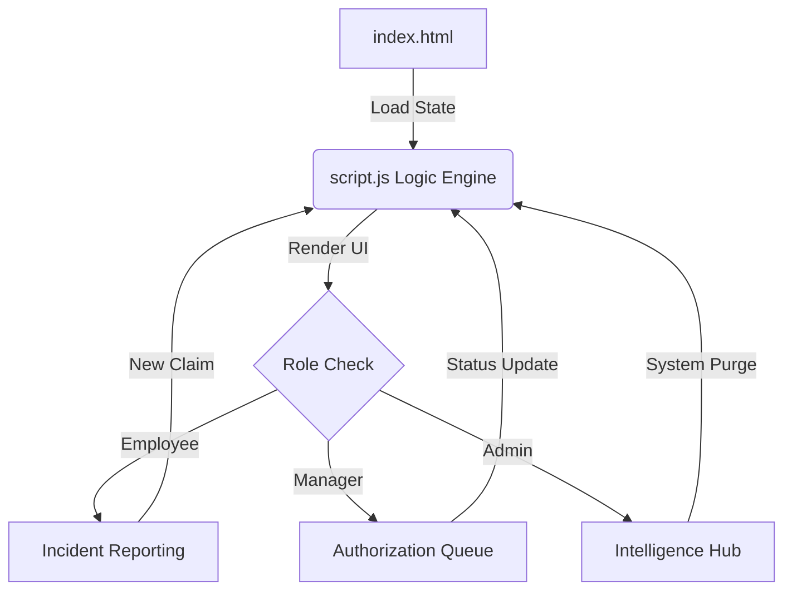

give me the readme content in markdown code of 

  

<h1 align="center">Insurify Pro — Enterprise Insurance Cloud</h1>

  <strong>The ultimate insurance infrastructure that turns complex claim management into a seamless digital experience.</strong>

<blockquote align="center">
  "Secure, Scalable, and Sophisticated – redefining how organizations manage vehicle assets."
</blockquote>

---

## 🔗 Live Infrastructure

The production environment is live and accessible at:  
🚀 **[bespoke-peony-6146ef.netlify.app](https://bespoke-peony-6146ef.netlify.app)**

---

## 🏛️ Architecture Overview

Insurify Pro operates as a **Multi-Role Hybrid System**, managing state across three distinct authorization layers: The Employee Runtime, Managerial Workflow, and Administrative Intelligence.

---

## ⚙️ Configuration Flow

The system synchronizes user roles and dynamic claims using a centralized state object, ensuring that updates in the reporting layer reflect immediately in the audit trail.

💎 Key Features
🔐 Multi-Tier Authorization
First-class support for Employee, Manager, and Admin roles. Each tier is isolated via a role-check logic, ensuring administrative settings are protected from the general reporting layer.

📝 Smart Incident Reporting
Real-time validation for vehicle Plate IDs and incident categories. Users can simulate digital proof attachments which are instantly queued for managerial review.

📊 Intelligence Hub
Admins and Managers get a high-level view of the Active Portfolio, Settled Assets, and Compliance Rates using a glassmorphic dashboard designed for rapid decision-making.

📱 Performance Optimized & Responsive
Ultralight Bundle: Built with vanilla JavaScript to ensure sub-second load times.

Fully Responsive: Mobile-first architecture that scales perfectly to 4K monitors.

Glassmorphism UI: Premium aesthetic using modern CSS3 backdrop filters and smooth transitions.

🔄 Workflow Walkthrough
1. The Reporting Phase (Employee)
Employees access their dedicated portal to register incidents. Upon dispatch, the system generates a unique INC-ID, timestamps the entry, and pushes it to the global appState.

2. The Authorization Phase (Manager)
Managers monitor the Review Queue. They have the authority to "Authorize" or "Dismiss" pending claims. Every decision triggers a system-wide audit log entry for total transparency.

3. The Management Phase (Admin)
Administrators oversee the Intelligence Hub. They manage global policy infrastructures, monitor backend service health, and have the power to purge system logs for maintenance.

📂 Project Structure
Bash
├── index.html      # Structural Architecture & UI Layouts
├── script.js       # Core Logic Engine, State Management & Routing
├── style.css       # Premium Styling, Animations & Responsive Queries
└── README.md       # Technical Documentation & Workflow Overview
⚙️ Installation & Setup
Clone the repository:

Bash
git clone [https://github.com/ushantsingh/Vehicle-Insurance-Management-System.git](https://github.com/ushantsingh/Vehicle-Insurance-Management-System.git)
Navigate to the directory:

Bash
cd Vehicle-Insurance-Management-System
Launch:

Open index.html in any modern browser.

Recommended: Use VS Code "Live Server" for hot-reloading.

📄 License
Distributed under the MIT License. See LICENSE for more information.

Developed with ❤️ by <a href="https://www.google.com/search?q=https://github.com/ushantsingh">Ushant Singh</a>

